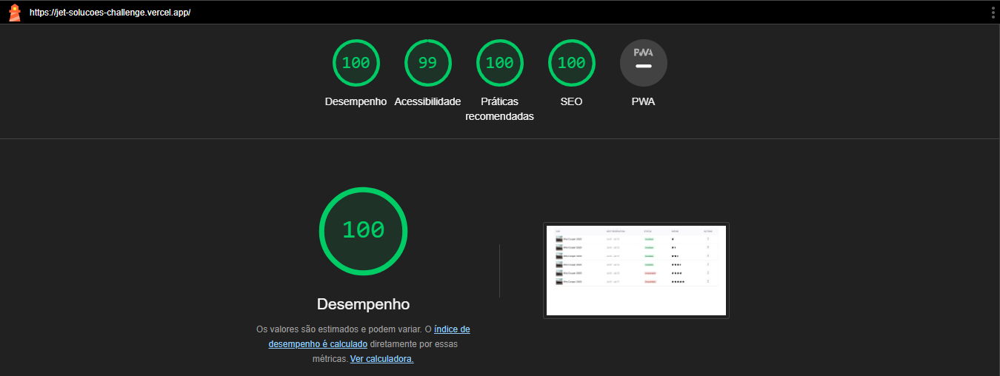
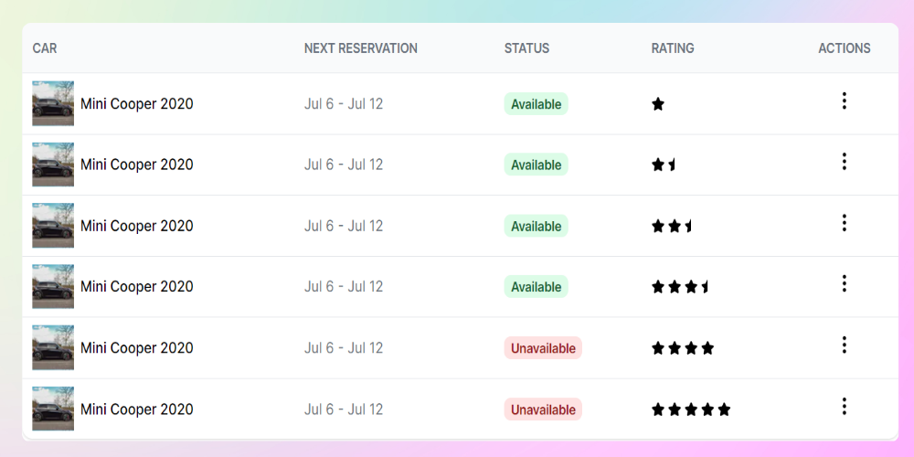
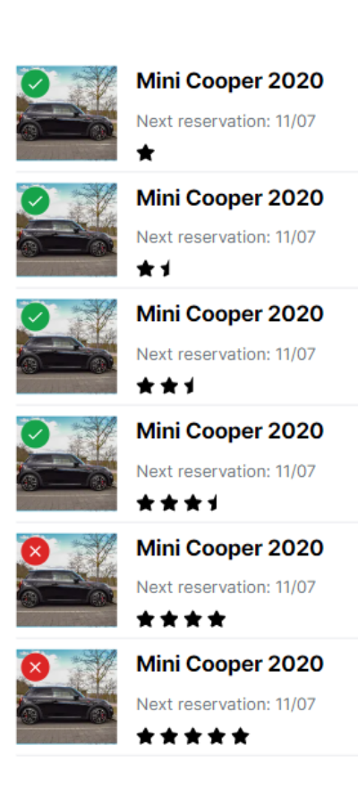

## Jet Soluções - Desafio Frontend

O desafio consiste em criar uma aplicação web, utilizando tecnologias como: React, Next, Typescript e TailwindCSS.



### Acessando a aplicação

A aplicação está hospedada no Vercel e pode ser acessada através do link: [https://jet-solucoes-challenge.vercel.app/](https://jet-solucoes-challenge.vercel.app/)



### Executando a aplicação localmente

Para executar a aplicação localmente, siga os passos abaixo:

1. Clone o repositório:

```bash
git clone https://github.com/devmatheuus/jet-solucoes-challenge.git
```

2. Acesse a pasta do projeto:

```bash
cd jet-solucoes-challenge
```

3. Instale as dependências:

```bash
pnpm install
```

4. Execute a aplicação:

```bash
pnpm dev
```

A aplicação estará disponível em [http://localhost:3000](http://localhost:3000).

### Imagem da aplicação em dispositivos móveis


